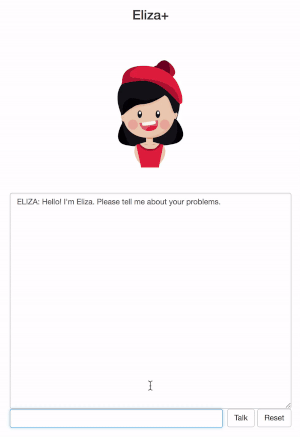

# ELIZA+

ELIZA is a natural language conversation program described by Joseph Weizenbaum in the 1960s. ELIZA simulated conversation by using a 'Mad Libs'-style methodology of pattern matching and substitution. While Weizenbaum's intent was to show through ELIZA how 'the responses of a non-directional psychotherapist in an initial psychiatric interview demonstrate that the communication between man and machine was superficial,' users actually found ELIZA to be very convincing and therapeutic. 

I first heard of ELIZA via the [Radiolab podcast](https://www.wnycstudios.org/story/137466-clever-bots/). I found the idea of a computer program acting as a therapist very appealing. Therapists are expensive. A computer program could listen to your qualms endlessly and for free. Some times, what we need is just to write down our thoughts and be prompted to keep writing down our thoughts in an encouraging and non-judgemental manner. 

While ELIZA's responses were originally limited to text, advancements in computation now allow us to easily integrate graphics. Similarly, recent advancements in natural language processing can enable sentiment detection of user-responses to create a more holistic chatbot experience. I made ELIZA+ as a simple extension of ELIZA to detect and respond to the sentiment of user-responses by updating an avatar. This purely client-side implementation means that user-input is never stored on any server, thereby protecting user privacy. Future work may include more complex integration of artificial intelligence algorithms and avatar personalization. 

Credit:

- ELIZA implementation: [elizabot.js by Norbert Landsteiner](http://www.masswerk.at/elizabot/)- 
- AFINN sentiment analysis: [Sentimood by Ethan Arterberry](https://github.com/soops/sentimood), a client-side version of [Sentimental by Roman K Yudin and Kevin M Roth](https://github.com/thinkroth/Sentimental) 
- Avatar graphics: [Girl avatar by Branhy](https://www.freepik.com/free-vector/girl-avatars-collection_872957.htm)

